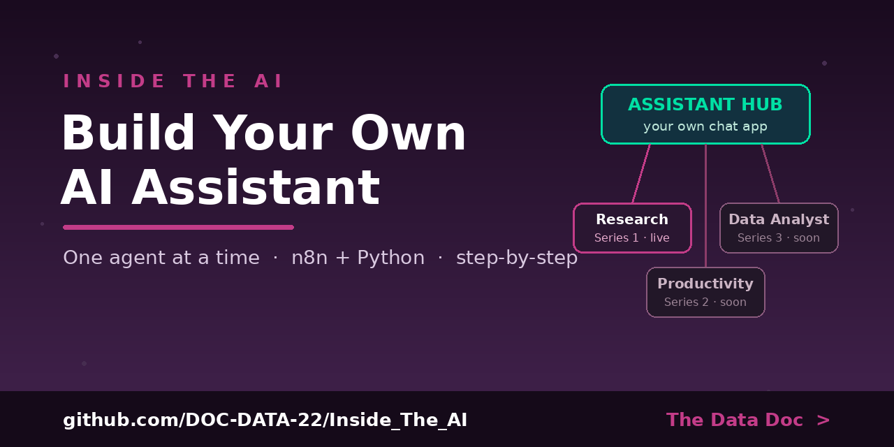

# Inside the AI — The Channel Repository

**The official home of the Inside the AI YouTube channel, hosted by The Data Doc.**

This channel has one mission: help you build **your own AI assistant** — a chat app you own,
with a growing team of specialized agents behind it. Every series on the channel adds one
agent. This repo holds everything: the app, the agents, and the step-by-step guides.

▶ **Watch:** search "Inside the AI podcast" on YouTube

---

## 🗺 The big picture

```
        YOUR ASSISTANT HUB  (a chat app you own — like ChatGPT, but yours)
                                      │
        ┌─────────────────────────────┼─────────────────────────────┐
        │                             │                             │
  🔎 Research Agent            🗓 Productivity Agent          📊 Data Analyst Agent
   Series 1 ✅ Live              Series 2 🔜 Vote now           Series 3 🔜 Planned
```

Full plan: **[The Channel Roadmap](docs/channel-roadmap.md)**

---

## 🚀 Start here

1. **[Get your free Gemini API key](docs/get-gemini-api-key.md)** — 3 minutes, no credit card.
2. **[Series 1, Week 1](01-youtube/series-1-research-assistant/week-1-agent/)** — build your first agent.
3. By Series 1, Week 4, you'll be running the **[Assistant Hub](assistant-hub/)** with your
   agent inside it.

**In a hurry?** The [`complete/`](complete/) folder is the finished Series 1 build, grab-and-go.
**Prefer Word docs?** Every guide is also in [`docs/word-guides/`](docs/word-guides/).

---

## 📂 What's in this repo

| Folder | What it is |
|--------|-----------|
| [`assistant-hub/`](assistant-hub/) | **The app everything plugs into** — your own ChatGPT |
| [`01-youtube/03-what-is-an-agent/`](01-youtube/03-what-is-an-agent/) | Session: **What Is an AI Agent? — The 3 Levels of AI** (deck + n8n workflow) |
| [`01-youtube/04-one-person-company-os/`](01-youtube/04-one-person-company-os/) | Episode 1: **The One-Person Company OS** — n8n + Google Sheets + Claude business automation (workflows + script) |
| [`01-youtube/series-1-research-assistant/`](01-youtube/series-1-research-assistant/) | Series 1, week by week: the research agent |
| [`01-youtube/series-2-productivity-agent/`](01-youtube/series-2-productivity-agent/) | Series 2 (planning — vote on the channel) |
| [`01-youtube/series-3-data-analyst-agent/`](01-youtube/series-3-data-analyst-agent/) | Series 3 (planned) |
| [`02-youtube-claude-code-improvement-docs/`](02-youtube-claude-code-improvement-docs/) | YouTube playlist: **Claude Code Improvement** — script documents for the Obsidian & NotebookLM videos |
| [`03-youtube-github-review/`](03-youtube-github-review/) | YouTube: **GitHub Review** — placeholder, content coming soon |
| [`complete/`](complete/) | The finished current build, one folder, grab-and-go |
| [`docs/`](docs/) | API key guide · news sources & data · troubleshooting · roadmap |

---

## 🧠 The one idea behind everything

A chatbot answers from what it already knows. An **agent** decides to *use tools* — get new
information, act, and answer with the result. Every agent on this channel is four parts:
**Model · Instructions · Tools · Loop.** Learn it once in Series 1; reuse it forever.

Two build paths, every week of every series:
- 🧩 **n8n** — visual, no-code (the main path)
- 🐍 **Python** — the same agent in readable code

## 🔐 Keys & safety
No API keys live in this repo — `.env.example` files hold placeholders only. Guides show you how
to create your own free key and store it safely (`.env` locally, encrypted credentials in n8n).

## 📄 License
MIT — use everything here however you like.
