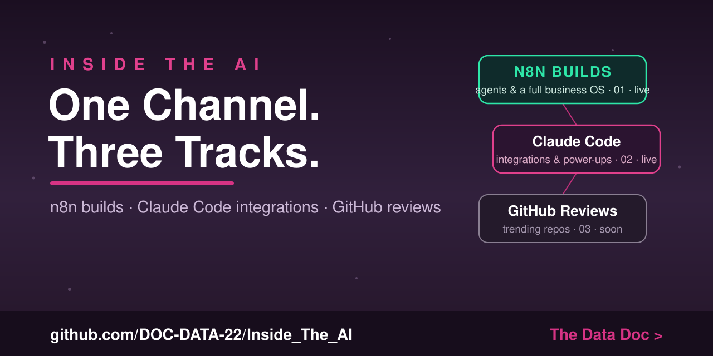

# Inside the AI — The Channel Repository

**The official home of the Inside the AI YouTube channel, hosted by The Data Doc.**

This repo holds everything the channel builds, in three tracks:

1. 🧩 **n8n builds** — agents and automation systems you can import and run, no code required
2. 🤖 **Claude Code integrations** — level up Claude Code by pairing it with tools you already use
3. 🔥 **Trending GitHub reviews** — hands-on reviews of the hottest repos on GitHub

▶ **Watch:** search "Inside the AI podcast" on YouTube

---

## 🗺 The three tracks

```
                          INSIDE THE AI
                                │
        ┌───────────────────────┼───────────────────────┐
        │                       │                       │
  🧩 n8n Builds          🤖 Claude Code            🔥 GitHub Reviews
   01-youtube-n8n/            Integrations              03-youtube-
   agents, workflows,     02-youtube-claude-        github-review/
   full business OS       code-improvement-docs/    coming soon
```

| Track | Folder | What's inside |
|-------|--------|---------------|
| **n8n builds** | [`01-youtube-n8n/`](01-youtube-n8n/) | What Is an Agent session, the One-Person Company OS, and the Series 1–3 assistant builds |
| **Claude Code integrations** | [`02-youtube-claude-code-improvement-docs/`](02-youtube-claude-code-improvement-docs/) | Script docs for the Claude Code Improvement playlist (Obsidian, NotebookLM) |
| **GitHub reviews** | [`03-youtube-github-review/`](03-youtube-github-review/) | Reviews of trending GitHub repos — content coming soon |

---

## 🚀 Start here

- **New to agents?** [What Is an AI Agent? — The 3 Levels of AI](01-youtube-n8n/03-what-is-an-agent/)
- **Want to build one?** [Get a free Gemini API key](docs/get-gemini-api-key.md), then start
  [Series 1, Week 1](01-youtube-n8n/series-1-research-assistant/week-1-agent/).
- **Using Claude Code?** The [Claude Code Improvement scripts](02-youtube-claude-code-improvement-docs/)
  show how to pair it with Obsidian and NotebookLM.

Full plan: **[The Channel Roadmap](docs/channel-roadmap.md)**

---

## 📂 What's in this repo

| Folder | What it is |
|--------|-----------|
| [`01-youtube-n8n/03-what-is-an-agent/`](01-youtube-n8n/03-what-is-an-agent/) | Session: **What Is an AI Agent? — The 3 Levels of AI** (deck + n8n workflow) |
| [`01-youtube-n8n/04-one-person-company-os/`](01-youtube-n8n/04-one-person-company-os/) | Episode 1: **The One-Person Company OS** — n8n + Google Sheets + Claude business automation (workflows + script) |
| [`01-youtube-n8n/series-1-research-assistant/`](01-youtube-n8n/series-1-research-assistant/) | Series 1, week by week: the research agent |
| [`01-youtube-n8n/series-2-productivity-agent/`](01-youtube-n8n/series-2-productivity-agent/) | Series 2 (planning — vote on the channel) |
| [`01-youtube-n8n/series-3-data-analyst-agent/`](01-youtube-n8n/series-3-data-analyst-agent/) | Series 3 (planned) |
| [`02-youtube-claude-code-improvement-docs/`](02-youtube-claude-code-improvement-docs/) | YouTube playlist: **Claude Code Improvement** — script documents for the Obsidian & NotebookLM videos |
| [`03-youtube-github-review/`](03-youtube-github-review/) | YouTube: **GitHub Review** — trending repo reviews, coming soon |
| [`docs/`](docs/) | API key guide · news sources & data · troubleshooting · roadmap |

---

## 🧠 The one idea behind everything

A chatbot answers from what it already knows. An **agent** decides to *use tools* — get new
information, act, and answer with the result. Every agent on this channel is four parts:
**Model · Instructions · Tools · Loop.** Learn it once; reuse it everywhere — in n8n, in
Claude Code, and in the repos we review.

## 🔐 Keys & safety
No API keys live in this repo — `.env.example` files hold placeholders only. Guides show you how
to create your own free key and store it safely (`.env` locally, encrypted credentials in n8n).

## 📄 License
MIT — use everything here however you like.
